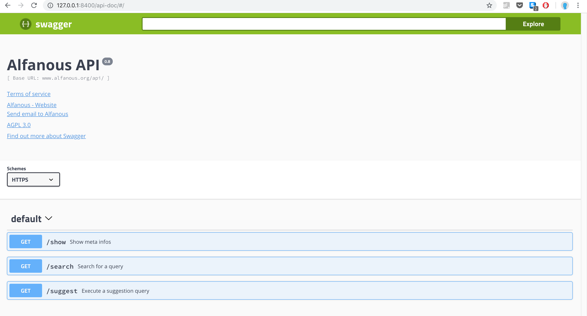

=================
Django Swagger UI
=================
Django swagger UI is a viewer for Swagger YAML files as html.  based on `swagger-yaml-to-html.py <https://gist.github.com/oseiskar/dbd51a3727fc96dcf5ed189fca491fb3>`_.

Quick start
-----------

1. Add "swagger_ui" to your ``INSTALLED_APPS`` setting like this::

    INSTALLED_APPS = [
        ...
        'swagger_ui',
        ...
    ]

2. Include the swagger ui URLconf in your project ``urls.py`` like this::

    path('', include('swagger_ui.urls')),

3. Add this variable ``SWAGGER_YAML_FILE`` to ``settings.py`` pointing to your YAML file

4. You will find the swagger api documentation in  `/api-doc/`.

